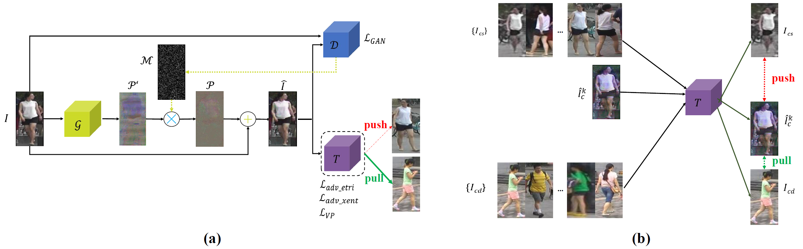
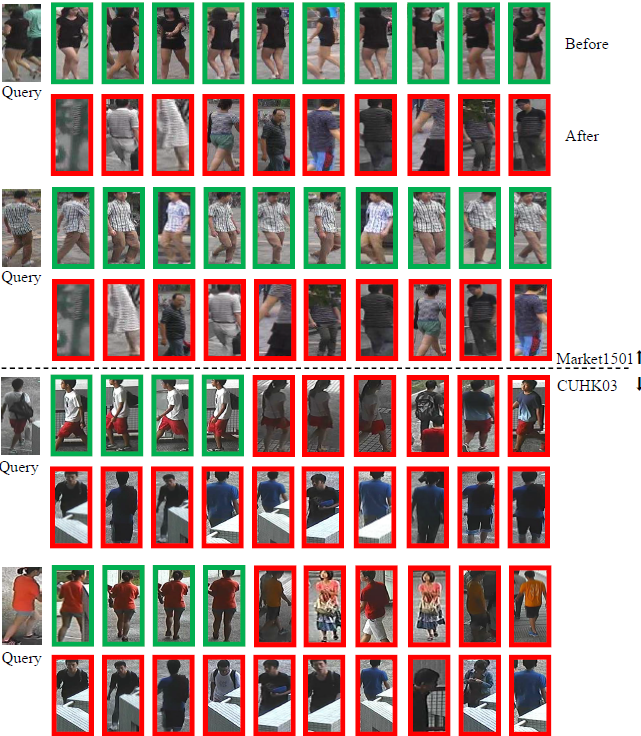

# Adversarial-attack-on-Person-ReID-With-Deep-Mis-Ranking
This is the code for the [CVPR'20 paper](https://arxiv.org/abs/2004.04199) "Transferable, Controllable, and Inconspicuous Adversarial Attacks on Person Re-identification With Deep Mis-Ranking." by Hongjun Wang, Guangrun Wang, Ya Li, Dongyu Zhang, Liang Lin.

<p align="center">
    
</p>

# Prerequisites
* Python2 / Python3
* Pytorch0.4.1 (do not test for >=Pytorch1.0)
* CUDA
* Numpy
* Matplotlib
* Scipy

# Prepare data
Create a directory to store reid datasets under this repo
```bash
mkdir data/
```

If you wanna store datasets in another directory, you need to specify `--root path_to_your/data` when running the training code. Please follow the instructions below to prepare each dataset. After that, you can simply do `-d the_dataset` when running the training code. 

**Market1501** :

1. Download dataset to `data/` from http://www.liangzheng.org/Project/project_reid.html.
2. Extract dataset and rename to `market1501`. The data structure would look like:
```
market1501/
    bounding_box_test/
    bounding_box_train/
    ...
```
3. Use `-d market1501` when running the training code.

**CUHK03** [13]:
1. Create a folder named `cuhk03/` under `data/`.
2. Download dataset to `data/cuhk03/` from http://www.ee.cuhk.edu.hk/~xgwang/CUHK_identification.html and extract `cuhk03_release.zip`, so you will have `data/cuhk03/cuhk03_release`.
3. Download new split [14] from [person-re-ranking](https://github.com/zhunzhong07/person-re-ranking/tree/master/evaluation/data/CUHK03). What you need are `cuhk03_new_protocol_config_detected.mat` and `cuhk03_new_protocol_config_labeled.mat`. Put these two mat files under `data/cuhk03`. Finally, the data structure would look like
```
cuhk03/
    cuhk03_release/
    cuhk03_new_protocol_config_detected.mat
    cuhk03_new_protocol_config_labeled.mat
    ...
```
4. Use `-d cuhk03` when running the training code. In default mode, we use new split (767/700). If you wanna use the original splits (1367/100) created by [13], specify `--cuhk03-classic-split`. As [13] computes CMC differently from Market1501, you might need to specify `--use-metric-cuhk03` for fair comparison with their method. In addition, we support both `labeled` and `detected` modes. The default mode loads `detected` images. Specify `--cuhk03-labeled` if you wanna train and test on `labeled` images.

**DukeMTMC-reID** [16, 17]:

1. Create a directory under `data/` called `dukemtmc-reid`.
2. Download dataset `DukeMTMC-reID.zip` from https://github.com/layumi/DukeMTMC-reID_evaluation#download-dataset and put it to `data/dukemtmc-reid`. Extract the zip file, which leads to
```
dukemtmc-reid/
    DukeMTMC-reid.zip # (you can delete this zip file, it is ok)
    DukeMTMC-reid/ # this folder contains 8 files.
```
3. Use `-d dukemtmcreid` when running the training code.


**MSMT17** [22]:
1. Create a directory named `msmt17/` under `data/`.
2. Download dataset `MSMT17_V1.tar.gz` to `data/msmt17/` from http://www.pkuvmc.com/publications/msmt17.html. Extract the file under the same folder, so you will have
```
msmt17/
    MSMT17_V1.tar.gz # (do whatever you want with this .tar file)
    MSMT17_V1/
        train/
        test/
        list_train.txt
        ... (totally six .txt files)
```
3. Use `-d msmt17` when running the training code.

# Prepare pretrained ReID models
1. Create a directory to store reid pretrained models under this repo

```bash
mkdir models/
```
2. Download the pretrained models or train the models from scratch by yourself offline

   2.1 Download Links

   [IDE](https://drive.google.com/open?id=1hVYGcuhfwMs25QVdo2R-ugXW4WyAzuHF)
   
   [DenseNet121](https://drive.google.com/drive/folders/1XSiVo0lqULQJyYv4T2pt6uA4qtxKSb6X?usp=sharing)

   [AlignedReID](https://drive.google.com/open?id=1YZ7J85f1Fcjft7sh2rlPs1s0dlcaFpf-)

   [PCB](https://drive.google.com/open?id=1xkA981JDESHxhGM_2N-ZdvboVXXzi3yd)

   [Mudeep](https://drive.google.com/open?id=1g6HBt5uCVSbLQL1JUOY_jZZqYKtRmVsX)

   [HACNN](https://drive.google.com/open?id=1ZxzY149vgagHzDUQLMuJqCpCSG3mtH3M)

   [CamStyle](https://drive.google.com/open?id=11WsAyhme4p8i3lNehYpfdB0jZtSSOTzx)

   [LSRO](https://drive.google.com/drive/folders/1cxeOJ3FU6qraHWU927HWC24E_MpXghP5?usp=sharing)

   [HHL](https://drive.google.com/open?id=1ZStrZ6qrB_kgcoB9BLXre81RiXtybBXD)

   [SPGAN](https://drive.google.com/open?id=1YwnmBjfhBHlVQmTRn1ehaHRe5cXVGg5Z)

   2.2 Training models from scratch (optional)

   Create a directory named by the targeted model (like `aligned/` or `hacnn/`) following `__init__.py`under `models/` and move the checkpoint of pretrained models to this directory. Details of naming rules can refer to the download link.

3. Customized ReID models (optional) 

   It is easy to test the robustness of any customized ReID models following the above steps (1→2.2→3). The extra thing you need to do is to add the structure of your own models to `models/` and register it in`__init__.py` .

# Train
Take attacking AlignedReID trained on Market1501 as an example:

```bash
python train.py \
  --targetmodel='aligned' \
  --dataset='market1501'\
  --mode='train' \
  --loss='xent_htri' \
  --ak_type=-1 \
  --temperature=-1 \
  --use_SSIM=2 \
  --epoch=40
```

# Test
Take attacking AlignedReID trained on Market1501 as an example:

```bash
python train.py \
  --targetmodel='aligned' \
  --dataset='market1501'\
  --G_resume_dir='./logs/aligned/market1501/best_G.pth.tar' \
  --mode='test' \
  --loss='xent_htri' \
  --ak_type=-1 \
  --temperature=-1 \
  --use_SSIM=2 \
  --epoch=40
```

# Results

<p align="center">
    
</p>


# Reminders

1. If you are using your *own* trained ReID models (no matter whether is customized), be careful about the name of variables and properly change or hold Line 38–53 in `__init__.py`.
2. You may notice some arguments and codes involve the attribute information, if you are interested in that you can easily find and download the extra attribute files about Market1501 or DukeMTMC. We have conducted some related experiments about attribute attack but it is *not* the main content of this paper.

# Reference

If you are interested in our work, please consider citing our paper.
```
@InProceedings{Wang_2020_CVPR,
author = {Wang, Hongjun and Wang, Guangrun and Li, Ya and Zhang, Dongyu and Lin, Liang},
title = {Transferable, Controllable, and Inconspicuous Adversarial Attacks on Person Re-identification With Deep Mis-Ranking},
booktitle = {IEEE/CVF Conference on Computer Vision and Pattern Recognition (CVPR)},
month = {June},
year = {2020}
} 
```

# Acknowledgements
Thanks for the following excellent works:

- Open-reid [code](https://github.com/Cysu/open-reid)
- AlignedReID [paper](https://www.sciencedirect.com/science/article/abs/pii/S0031320319302031?via%3Dihub#!) and [code](https://github.com/michuanhaohao/AlignedReID) by michuanhaohao
- Person ReID baseline [code](https://github.com/layumi/Person_reID_baseline_pytorch) by layumi
- LSRO [paper](https://arxiv.org/abs/1701.07717) and [code](https://github.com/layumi/Person-reID_GAN) by layumi
- HHL [paper](http://openaccess.thecvf.com/content_ECCV_2018/html/Zhun_Zhong_Generalizing_A_Person_ECCV_2018_paper.html) and [code](https://github.com/zhunzhong07/HHL) by zhunzhong07
